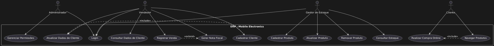
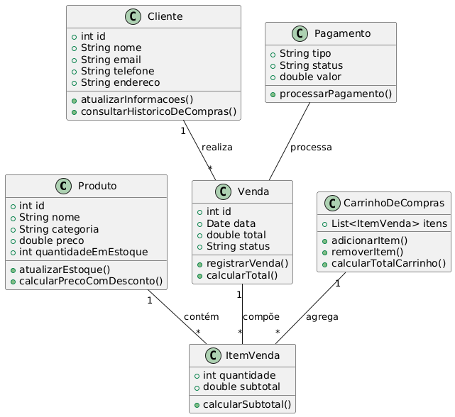
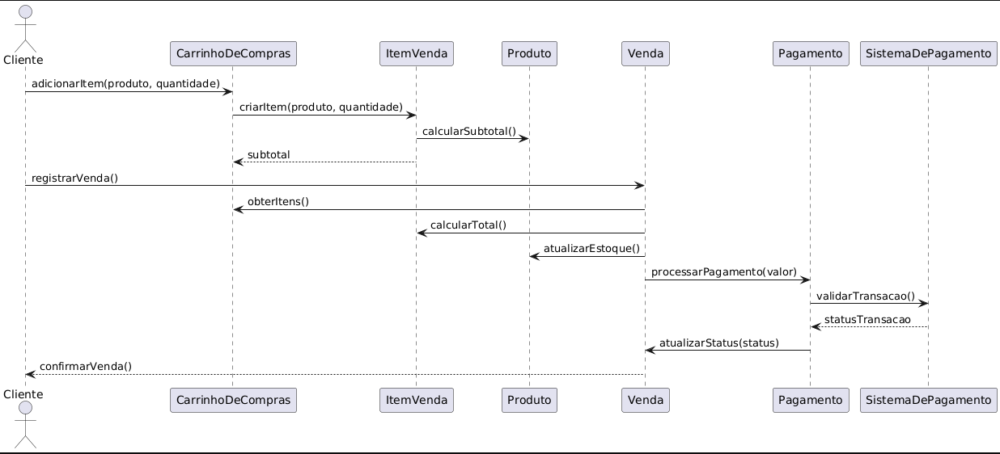

# ProjetodeSoftware

Meu nome é Caio Augusto Homem de Melo Monteiro dos Santos e meu RA é 10403125 e este será meu projeto para a matéria de Projeto de Software, esse projeto consiste em tilizar os principais conceito e técnicas de modelagem de sistemas (adquiridos durante o
semestre nessa e em outras disciplinas, além de pesquisas), desenvolver a diagramação
completada de um projeto de software, considerando todas as etapas do projeto.
Ao final do projeto, os discentes serão capazes de aplicar os conhecimentos e habilidades
adquiridos em modelagem de sistemas para:
• Planejar um software completo que atenda às necessidades de um cliente real ou
simulado.
• Aplicar as melhores práticas da modelagem UML em todas as etapas do ciclo de vida do
projeto, desde a definição dos requisitos até a entrega do produto.
• Trabalhar em equipe de forma colaborativa e eficiente para alcançar os objetivos do
projeto.
• Comunicar-se de forma clara e eficaz com o cliente, a equipe e outras partes interessadas.
- Escopo do projeto
A Mobile Eletronics é uma empresa de pequeno porte especializada na venda de produtos
eletrônicos como computadores, smartphones, tablets e acessórios diversos. A empresa tem uma
loja física e uma operação de vendas on-line. Com o crescimento das vendas e a expansão do
catálogo de produtos, a empresa está enfrentando desafios na gestão eficiente de seus processos
operacionais, incluindo a gestão de estoque, clientes e vendas.
Para melhorar a eficiência e centralizar as operações, a Mobile Eletronics contratou a consultoria do
Mackenzie chamada MackTotvs (representada por cada equipe deste projeto) para desenvolver seu
ERP1
. Este sistema deve permitir o gerenciamento centralizado de produtos, clientes e vendas,
garantindo a integridade de acessibilidade de informações.
Portanto, o projeto consiste em desenvolver a modelagem de um sistema ERP simplificado, focando
em três módulos principais:
• Gestão de produtos;
• Gestão de clientes;
• Gestão de vendas.

# Diagramas

Casos de uso:

Classes:

Sequencia:

# Especificação de Casos de Uso - Sistema ERP Mobile Eletronics

### Caso de Uso 1: Login
- **Ator Principal**: Administrador, Vendedor, Gestor de Estoque
- **Descrição**: O ator deve realizar a autenticação no sistema para acessar as funcionalidades correspondentes ao seu perfil.
- **Pré-condições**: O ator deve ter um login e senha válidos no sistema.
- **Fluxo Principal**:
  1. O ator acessa a tela de login.
  2. O ator insere seu login e senha.
  3. O sistema valida as credenciais.
  4. O ator é direcionado para a interface principal do sistema com as permissões apropriadas.
- **Pós-condições**: O ator está autenticado e tem acesso ao sistema.
- **Fluxo Alternativo**:
  - 3A: Se as credenciais forem inválidas, o sistema exibe uma mensagem de erro e o ator deve tentar novamente.

### Caso de Uso 2: Gerenciar Produtos
- **Ator Principal**: Gestor de Estoque
- **Descrição**: O gestor de estoque pode adicionar, atualizar ou remover produtos do sistema.
- **Pré-condições**: O ator deve estar autenticado como gestor de estoque.
- **Fluxo Principal**:
  1. O gestor de estoque acessa o módulo de produtos.
  2. Ele pode escolher entre adicionar um novo produto, atualizar um existente ou remover um produto do sistema.
  3. O sistema processa a ação e atualiza o catálogo de produtos.
- **Pós-condições**: O catálogo de produtos é atualizado conforme as alterações realizadas.
- **Fluxo Alternativo**:
  - 2A: Se o gestor tentar remover um produto que está vinculado a uma venda, o sistema não permitirá a remoção.

### Caso de Uso 3: Gerenciar Clientes
- **Ator Principal**: Vendedor
- **Descrição**: O vendedor pode cadastrar novos clientes, atualizar informações de clientes existentes ou remover clientes do sistema.
- **Pré-condições**: O ator deve estar autenticado como vendedor.
- **Fluxo Principal**:
  1. O vendedor acessa o módulo de gestão de clientes.
  2. Ele pode escolher entre cadastrar um novo cliente, atualizar um cliente existente ou remover um cliente.
  3. O sistema realiza a ação e atualiza os registros de clientes.
- **Pós-condições**: Os dados dos clientes são atualizados conforme as mudanças feitas pelo vendedor.
- **Fluxo Alternativo**:
  - 2A: Se o vendedor tentar remover um cliente vinculado a uma venda recente, o sistema não permitirá a remoção.

### Caso de Uso 4: Gerenciar Vendas
- **Ator Principal**: Vendedor
- **Descrição**: O vendedor pode registrar novas vendas, atualizar o status de vendas em andamento ou cancelar vendas.
- **Pré-condições**: O ator deve estar autenticado como vendedor.
- **Fluxo Principal**:
  1. O vendedor acessa o módulo de vendas.
  2. Ele pode registrar uma nova venda, atualizar uma venda existente ou cancelar uma venda.
  3. O sistema registra ou atualiza a venda e ajusta o estoque automaticamente.
- **Pós-condições**: As vendas são atualizadas no sistema e o estoque é modificado conforme necessário.
- **Fluxo Alternativo**:
  - 2A: Se o estoque não for suficiente para a venda, o sistema exibe um alerta e não permite concluir a venda.

### Caso de Uso 5: Consultar Estoque
- **Ator Principal**: Gestor de Estoque, Vendedor
- **Descrição**: O ator pode consultar a quantidade disponível e os detalhes dos produtos no estoque.
- **Pré-condições**: O ator deve estar autenticado.
- **Fluxo Principal**:
  1. O ator acessa o módulo de estoque.
  2. Ele seleciona o produto desejado.
  3. O sistema exibe a quantidade disponível e outras informações relevantes.
- **Pós-condições**: O ator visualiza as informações atualizadas sobre o estoque do produto.

